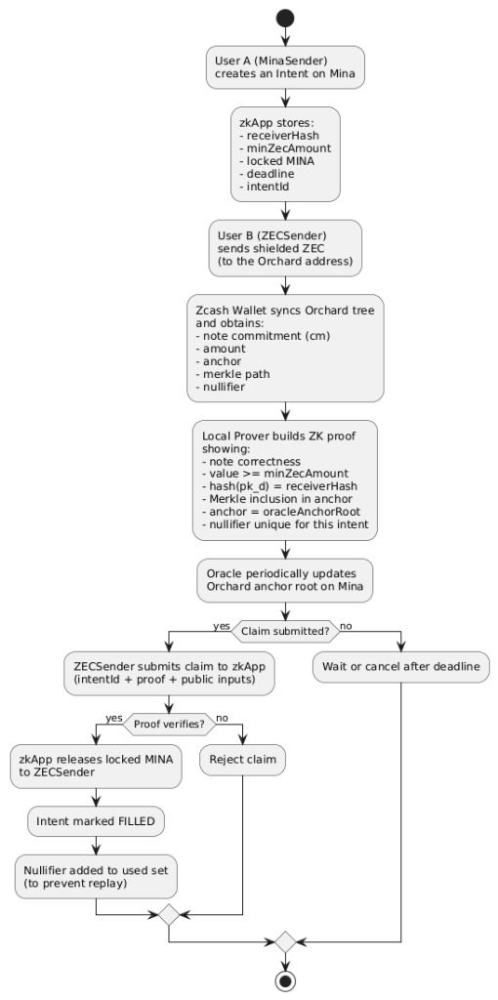

# ZIMA – Shielded Zcash → Mina Intent Bridge (PoC)

<p align="center">
  
</p>

**ZIMA** is a proof-of-concept **shielded bridge** connecting **Zcash (Orchard)** and **Mina Protocol**. It represents a new approach to cross-chain interoperability where **privacy is the default**, not an afterthought.

In a world where most bridges require you to doxx your transaction history or trust a centralized set of validators with your view keys, ZIMA takes a different path. It allows a Zcash user to prove **locally** that they sent shielded ZEC to a specific Orchard address and claim MINA—without ever revealing their identity, their balance, or their transaction graph to the bridge or the public.

## The Core Philosophy: Uncompromising Privacy

The problem with existing "private" bridges is that they often require a compromise. You either have to deposit into a transparent pool (revealing the amount and timing) or share your "view key" with a bridge operator so they can verify your deposit.

**ZIMA changes this paradigm.**

*   **No View Keys:** The bridge contract never asks for and never sees your view key. Your privacy remains under your control.
*   **No Plaintext Data:** The bridge never sees the value of your note or the sender/receiver addresses in plaintext.
*   **Client-Side Proving:** All the heavy lifting—the generation of the Zero-Knowledge Proof (ZKP)—happens on **your** device. You only submit a mathematical proof to Mina that says, *"I have validly sent the required ZEC,"* without showing *how* or *who* you are.

---

## The "Custom Wallet" Challenge

Building ZIMA wasn't just about writing a smart contract; it required rethinking how we interact with the Zcash blockchain.

One of the most significant technical hurdles I encountered was the "black box" nature of standard Zcash wallets. To generate a valid ZK proof for the bridge, I needed access to low-level cryptographic "witness" data—specifically, the **Merkle authentication path** and the **Orchard note commitment** for the specific transaction.

Standard wallets (like Zecwallet or YWallet) are designed to keep this data internal for security and simplicity. They don't provide an API to export a specific note's witness data.

**I had to build a solution.**

I developed a **custom Zcash wallet implementation** (using Rust) specifically for ZIMA. This wallet acts as a standard shielded wallet but has a crucial "Power User" feature: it can export the exact witness data (Merkle paths, anchors, nullifiers) needed for the ZIMA bridge circuit. This allows the ZECSender to generate the proof locally, ensuring that no sensitive data ever leaves their machine.

---

## How It Works: The ZIMA Protocol

The protocol is based on an **"Intent"** system. Instead of wrapping tokens, users swap assets by fulfilling intents.



### 1. The Setup (Mina)
A **MinaSender** wants to buy ZEC. They lock their MINA into the ZIMA zkApp smart contract, creating an **Intent**.
*   *The Intent:* "I will pay **Y MINA** to anyone who can prove they sent **X ZEC** to my shielded Orchard address (hash: H)."
*   The actual Zcash address is never revealed on-chain; only its Poseidon hash is stored.

### 2. The Shielded Payment (Zcash)
A **ZECSender** (you) sees this intent. You use the ZIMA custom wallet to send a standard **shielded Orchard transaction** to the MinaSender's address.
*   To the outside world, this looks like any other encrypted Zcash transaction. No one can link it to the bridge intent.

### 3. Local Proof Generation (Off-Chain)
This is where the magic happens. Your wallet waits for the transaction to be mined. Once confirmed, it extracts the **witness data** (the proof that your note exists in the Orchard tree).
You then run the ZIMA Prover locally. This generates a **Zero-Knowledge Proof** attesting that:
*   You spent a valid note.
*   The note was sent to the correct address (matching the hash `H`).
*   The amount was correct.
*   **Crucially:** It does *not* reveal which note was spent or who sent it.

### 4. The Claim (Mina)
You submit this proof to the **ZIMA zkApp** on Mina.
The zkApp verifies the proof against the current **Orchard Anchor** (provided by an Oracle). If the proof is valid, the contract releases the locked MINA to your address.

---

## On-Chain Components

The system relies on a minimal footprint on the Mina blockchain to maintain efficiency and privacy.

### The ZIMA zkApp
The smart contract that enforces the rules. It stores:
*   **Intents:** The open offers to swap MINA for ZEC.
*   **Nullifiers:** A list of "spent" proof nullifiers to prevent someone from using the same Zcash payment to claim MINA twice.
*   **Oracle Anchor:** The root of the Zcash Orchard Note Commitment Tree, updated by an Oracle.

**Deployed Contract Address (Mina Devnet):**
```
B62qnoC1EUAQuiSrUG8VCA5DCZijm65ovWgESBct776SpkunSRe3oo3
```

### The Oracle
A lightweight service that monitors the Zcash blockchain and updates the ZIMA zkApp with the latest **Orchard Anchor**. This allows the zkApp to verify that the ZEC transaction actually occurred on the real Zcash chain.

---

## Future Vision

ZIMA is currently a research-grade Proof of Concept. It demonstrates that **cross-chain privacy does not require a trusted third party**.

In the future, I plan to:
*   **Decentralize the Oracle:** Replace the single oracle with a consensus-based or ZK-light-client approach.
*   **Improve the Wallet UX:** Integrate the "witness export" feature into a more user-friendly web or browser-extension wallet.
*   **Generalize Intents:** Allow for more complex swap logic and partial fills.
*   **Add QR code deposit to fronted for sending zcash, providing better UX

ZIMA is a step towards a future where you can move value between chains without leaving a digital footprint.

---

## How to Use

### Prerequisites
- **Node.js** (v18 or later)
- **Rust** (latest stable)
- **Mina zkApp CLI** (`npm install -g zkapp-cli`)

### Installation

1.  **Clone the repository:**
    ```bash
    git clone https://github.com/kerem6790/Zcash-Mina-Bridge.git
    cd Zcash-Mina-Bridge
    ```

2.  **Install dependencies:**
    ```bash
    cd zk-app
    npm install
    ```

### Running Tests

To verify the core logic of the bridge (creating intents, verifying proofs, and claiming funds), run the test suite:

```bash
npm run test
```

This will execute the local Mina blockchain mock and simulate the entire flow:
1.  Creating an intent.
2.  Mocking a valid Zcash proof.
3.  Successfully claiming the locked MINA.
4.  Attempting a double-spend (which should fail).

### Deployment (Devnet)

To deploy the contract to the Mina Devnet:

1.  Configure your deployment alias in `config.json`.
2.  Run the deploy command:
    ```bash
    zk deploy devnet
    ```

For more detailed technical documentation on the custom wallet or the circuit architecture, please refer to the `docs/` folder.
